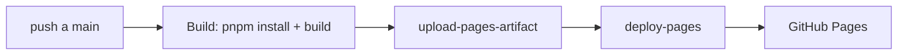

# 🎤 Resolución de Conflictos en Git


Presentación académica interactiva sobre cómo abordar y resolver conflictos
en Git: desde qué son y por qué ocurren, hasta una demo reproducible paso a
paso y las buenas prácticas para minimizarlos.

**🔗 En vivo:** [nodo-studio.github.io/presentacion-conflictos-git](https://nodo-studio.github.io/presentacion-conflictos-git/)

## ✨ Características

- 14 diapositivas construidas con **reveal.js 6** y **React 19**
- **Auto-animate**: el código se transforma en pantalla (limpio → en conflicto)
- **Resaltado de líneas** con zoom suave y navegación por fases
- **Demo reproducible**: comandos reales para provocar y resolver un conflicto
- Paleta de colores propia (tema oscuro), tipografías auto-alojadas
- Despliegue continuo a **GitHub Pages** con GitHub Actions

## 🧰 Stack

| Capa            | Tecnología                                                 |
| --------------- | ---------------------------------------------------------- |
| Interfaz        | React 19 + TypeScript                                      |
| Slides          | reveal.js 6                                                |
| Build           | Vite 8                                                     |
| Estilos         | CSS puro con variables de diseño (`--color-*`)             |
| Fuentes         | Rethink Sans + JetBrains Mono (@fontsource, auto-alojadas) |
| Package manager | pnpm                                                       |
| CI/CD           | GitHub Actions → GitHub Pages                              |

## 📦 Requisitos

- Node.js ≥ 20 (desarrollado con v24)
- pnpm ≥ 9 (desarrollado con v11)

## 🚀 Uso local

```bash
pnpm install     # instalar dependencias
pnpm dev         # servidor de desarrollo (http://localhost:5173)
pnpm build       # compilar a dist/
pnpm preview     # previsualizar el build de producción
pnpm lint        # ESLint
```

## 📁 Estructura

```
src/
├── App.tsx           # inicializa Reveal.js (constructor v6)
├── main.tsx          # punto de entrada
├── index.css         # paleta, tipografías y estilos
└── slides/           # una diapositiva = un componente
    ├── Portada.tsx
    ├── QueEsConflicto.tsx
    ├── PorqueExisten.tsx
    ├── CuandoAparecen.tsx
    ├── Marcadores.tsx
    ├── DemoConflicto.tsx
    ├── DemoResolver.tsx
    ├── Herramientas.tsx
    ├── BuenasPracticas.tsx
    ├── ComandosClave.tsx
    ├── Resumen.tsx
    └── Gracias.tsx
```

## 🌿 Flujo de trabajo Git

```
main     ← rama de despliegue (producción), solo recibe PRs de release
develop  ← integración del trabajo en curso
feat/*   ← una rama por bloque de trabajo, nace de develop
```

- **Conventional Commits**: `feat:`, `style:`, `fix:`, `docs:`
- Flujo: `feat/*` → PR → `develop` → PR de release → `main`

## 🚀 CI/CD



- Workflow: [`.github/workflows/deploy.yml`](.github/workflows/deploy.yml)
- Se ejecuta con cada push a `main` (y manual con `workflow_dispatch`)
- **No requiere secrets**: usa el token automático de GitHub

## 📄 Créditos

- [reveal.js](https://revealjs.com) — Hakim El Hattab (MIT)
- [highlight.js](https://highlightjs.org) — sintaxis de código
- Fuentes [Rethink Sans](https://fonts.google.com/specimen/Rethink+Sans) y
  [JetBrains Mono](https://www.jetbrains.com/lp/mono/) (SIL OFL)
- Contenido: Jose Daniel Anacona — NodoStudio

## 📝 Licencia

MIT — ver [LICENSE](LICENSE)
Flujo git para el README
git switch develop && git pull origin develop
git switch -c feat/readme
